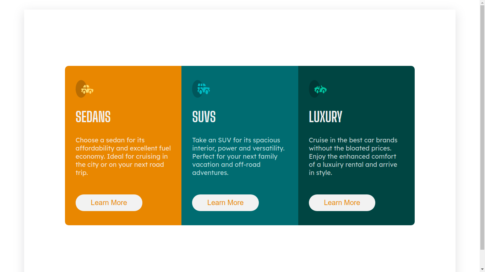

# Frontend Mentor - 3-column preview card component solution

This is a solution to the [3-column preview card component challenge on Frontend Mentor](https://www.frontendmentor.io/challenges/3column-preview-card-component-pH92eAR2-). Frontend Mentor challenges help you improve your coding skills by building realistic projects. 

## Table of contents

- [Overview](#overview)
  - [The challenge](#the-challenge)
  - [Screenshot](#screenshot)
  - [Links](#links)
- [My process](#my-process)
  - [Built with](#built-with)
  - [What I learned](#what-i-learned)
  - [Continued development](#continued-development)
  - [Useful resources](#useful-resources)
- [Author](#author)
- [Acknowledgments](#acknowledgments)

## Overview

### The challenge

Users should be able to:

- View cards layout on different devices and hover on buttons

### Screenshot

### Links

- Solution URL: [https://github.com/iddimsangi/cardspreview_sass](https://github.com/iddimsangi/cardspreview_sass)
- Live Site URL: [https://61b0e932767578134785e7e9--peaceful-jepsen-077221.netlify.app/](https://adrianburgoscolas.github.io/3-column-preview-card-component-main/)

## My process

### Built with

- React
- HTML5 markup
- CSS and SASS 
- Flexbox
-Media Queries

### What I learned

In this project I was be able to level up my skill using a flexbox and practicing Sass(uses of @mixins), also improving my react skills.

### Continued development

Need to keep improving React with Sass.

### Useful resources

- [css box shadow](https://getcssscan.com/css-box-shadow-examples) 

## Author
- Frontend Mentor - [@IDDI MSANGI](https://app.slack.com/client/TCYEB44S2/D02PW41BK8W/user_profile/U01G7EAT82J)
- Linkedin - [https://www.linkedin.com/in/iddimsangi/](https://www.linkedin.com/in/iddimsangi/)
